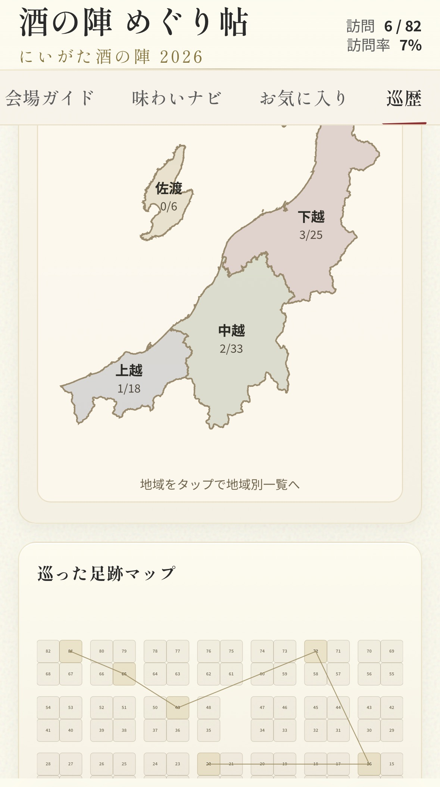

# 🍶 酒の陣 めぐり帖（Niigata Sake no Jin Map App）
酒イベントでの「回った酒蔵」「飲んだお酒」を記録・振り返りできるマップアプリ

にいがた酒の陣で使うために個人開発した、
酒造巡りを記録できるイベントマップアプリです。

訪問した酒造や飲んだお酒のメモを、
マップとタイムラインで振り返ることができます。

実際のイベントで「どの酒蔵回ったっけ？」を防ぐために作りました。

※本アプリは個人開発による非公式アプリです。

> An unofficial map and tasting log app for Niigata Sake no Jin.  
> This public repository contains a sample-data edition so the UI and behavior can be explored without the real event dataset.

## デモ

### まずはここから試せます(サンプルデータ版）
https://slothcafe.github.io/sakenojin_map_2026/

### 実データ版(実際のイベントで使用したもの)
実際のイベントで使用した構成の動作版はこちら

https://sakenojin-map.pages.dev/

※スマートフォンでの利用を想定しています

## スクリーンショット

| 画面 | 説明 | 画像 |
| --- | --- | --- |
| 会場ガイド | 会場全体を見ながらブースを選択 |  |
| 味わいナビ | 味わい軸に応じたヒートマップ表示 |  |
| 巡歴 | 地域毎の訪問状況, 巡回ルート, タイムラインの振り返り |  |


## 主な機能
- 🗺️ 会場マップ上で酒蔵ブースを確認
- 🍶 味わい軸ごとのヒートマップ表示
- 🕒 訪問履歴（タイムライン・ルート表示）
- 📝 テイスティングメモ記録
- ⭐ お気に入り登録
- 💾 JSONバックアップ / インポート
- 📱 PWA対応（電波の不安定な会場でもスムーズに動作）

## 特徴
- 完全クライアントサイド（IndexedDB）
- オフラインでも利用可能（PWA）
- データをJSONで持ち出し可能


## こんな人におすすめ
- 酒イベントを効率よく回りたい
- 飲んだお酒を記録したい
- イベント後に振り返りたい


## このリポジトリについて

このリポジトリは「公開用のサンプルデータ版」です。
- 実際のイベントデータは含まれていません
- クローンしてすぐ動作確認できるようにサンプルデータを同梱しています
- UI・機能の挙動は実運用版とほぼ同じです

実データ版とは一部内容が異なりますが、
アプリの機能や挙動は確認できるようになっています。

## 技術スタック

- Vue 3
- Vue Router
- Vite
- vite-plugin-pwa
- idb (IndexedDBラッパー)

## セットアップ
### 開発環境

```bash
# リポジトリのクローン
git clone https://github.com/slothcafe/sakenojin_map_2026.git
cd sakenojin_map_2026

# 依存関係のインストール
npm install

# 開発サーバ起動
npm run dev
```

開発サーバー起動後、表示された URL をブラウザで開いてください。

### ビルド

```bash
npm run build
```

ローカルでビルド成果物を確認する場合は、続けて以下を実行します。

```bash
npm run preview
```

## ディレクトリ構成

- `src/views/`
  画面単位の Vue コンポーネント
- `src/components/`
  再利用コンポーネント
- `src/assets/data/`
  サンプル JSON や地図データ
- `src/services/`
  初期データ読み込みや永続化まわり
- `public/`
  favicon、OGP、PWA アイコンなどの静的ファイル
- `doc/`
  README 用の素材や参考スクリーンショット

## データ出典
- 酒造情報: にいがた酒の陣 公式サイト
  [https://www.niigata-sake.or.jp/sakenojin/](https://www.niigata-sake.or.jp/sakenojin/)

- 地図データ: 国土数値情報（行政区域データ）
  [https://nlftp.mlit.go.jp/](https://nlftp.mlit.go.jp/)

※ 公開情報をもとに加工・整理して利用しています。


## 開発記事

開発過程は以下の記事で紹介しています。

- [にいがた酒の陣で「どこの酒蔵行ったっけ？」問題を防ぐマップアプリを10日で作ってみた](https://zenn.dev/dacho_slothcafe/articles/bb3cd4035f7400)
- [生成AIで作った「酒の陣マップアプリ」を実際の「にいがた酒の陣」で使ってみた](https://zenn.dev/dacho_slothcafe/articles/1dbeb27db49977)
- [記事一覧](https://zenn.dev/dacho_slothcafe)


## 補足
- データはブラウザの IndexedDB に保存されます
- 本アプリは個人開発による非公式アプリです
- 個人開発のため、動作保証はありません
- 公開版はサンプルデータ構成のため、実運用版とは一部表示が異なります

## License

MIT

